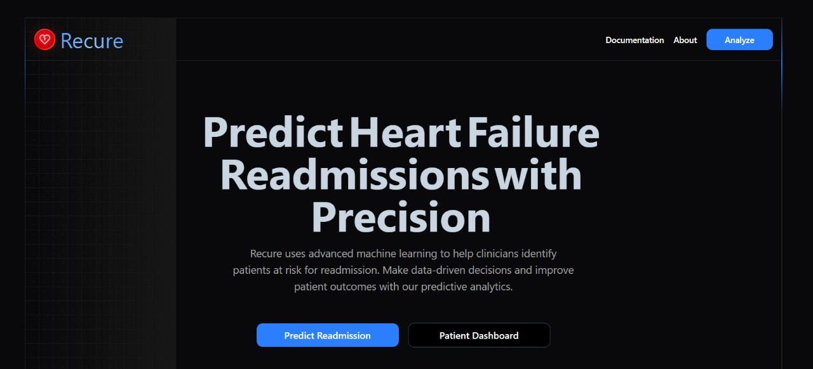
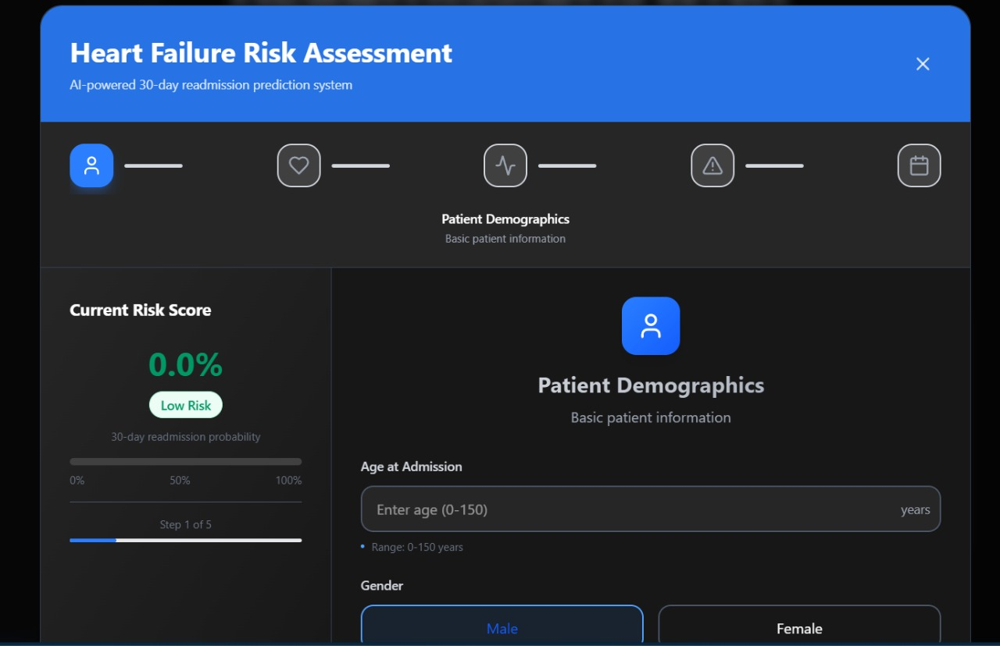
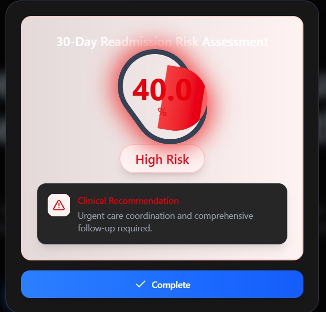
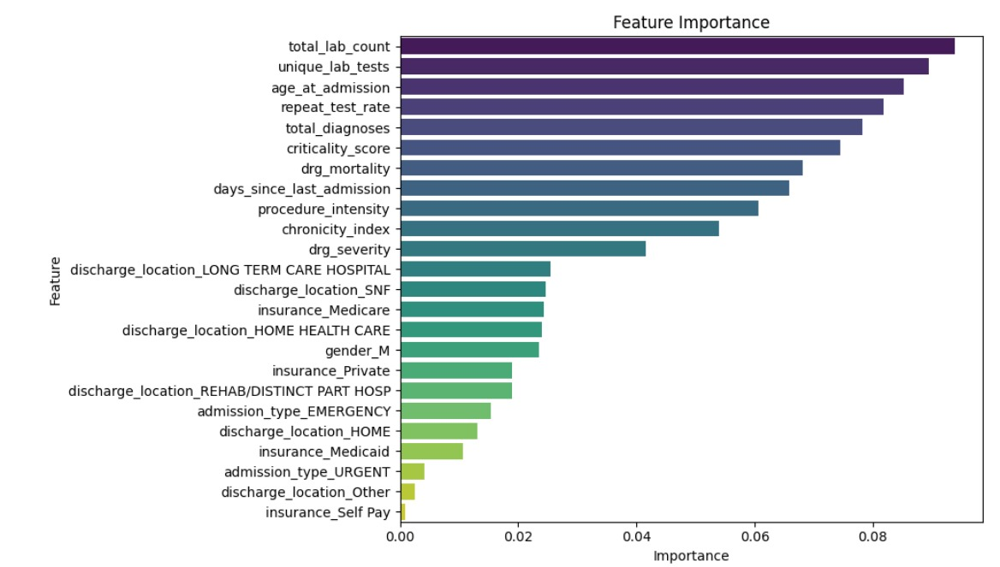
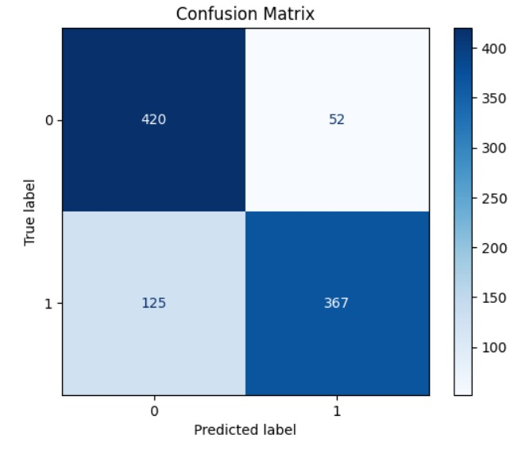
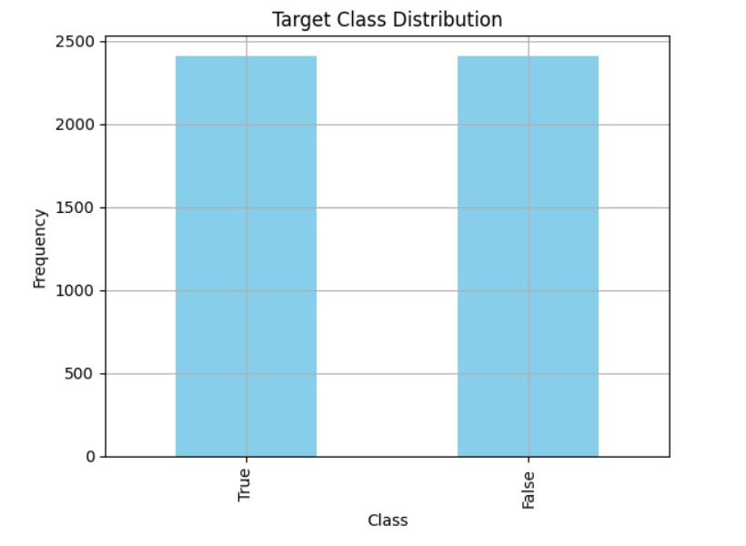
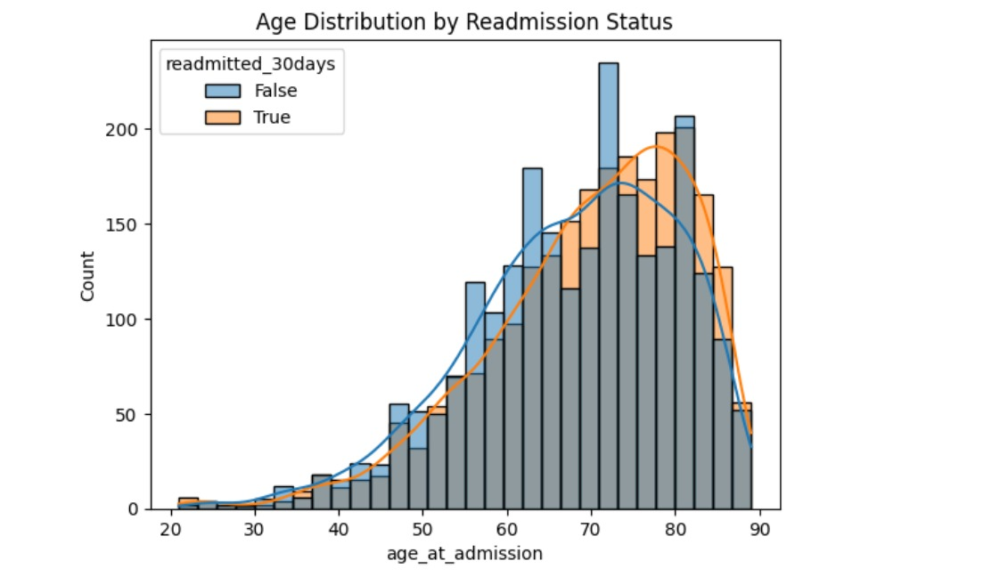
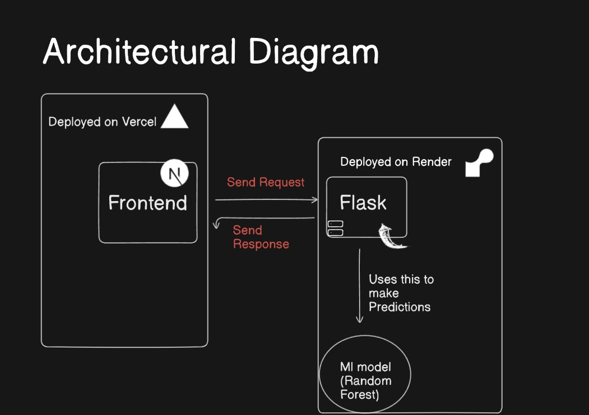

# Recure

Recure is a web application that uses advanced machine learning to help clinicians identify patients at risk for 30-day readmission due to heart failure. By analyzing various patient data points, Recure provides a risk score, enabling data-driven decisions and improved patient outcomes.

## Team Recure (Veersa Technologies Hackathon)

*   Aryan Gupta 
*   Diya Dhankar
*   Harsh Mahajan
*   Ishika Deshwal

## Source Code

[View on GitHub](https://github.com/HarshMN2345/TEAM-RECURE-VEERSA-SUBMISSION)

## Design

The UI/UX designs for Recure were created in Figma. You can view the designs here: [Link to Figma Designs](#) (Please replace # with your actual Figma link).

## Screenshots







## Video Demo

[Watch the project demo video](https://drive.google.com/file/d/1VbuYXbgHqtECfsVfBGvwD-_tW3tD57VU/view?usp=sharing)

## Model Training

Details about the model training process, dataset, and methodologies can be found in the `model training` directory.

### Model Visualizations






## Features

*   **Multi-step Risk Assessment:** A comprehensive, multi-step form to input patient demographics, clinical history, current admission details, severity assessment, and discharge planning information.
*   **Real-time Risk Scoring:** Dynamically updates the readmission risk score as data is entered at each step.
*   **Interactive Visualizations:** Includes charts and visual aids to represent data like age distribution and clinical metrics.
*   **API Status Indication:** Shows if the backend API is connected and displays errors if any occur.

## Tech Stack

*   **Frontend:** Next.js, React, Tailwind CSS, Shadcn UI, Framer Motion
*   **Backend:** Flask (Python), scikit-learn, pandas, numpy
*   **Deployment (Backend):** Render (using Gunicorn)

## Architecture



The Recure application follows a client-server architecture:

*   **Frontend (Client-Side):**
    *   Built with Next.js and React, the frontend is responsible for the user interface and user experience.
    *   It captures patient data through a multi-step form.
    *   It communicates with the backend API to send data and receive risk score predictions.
    *   Shadcn UI and Tailwind CSS are used for styling, and Framer Motion for animations.

*   **Backend (Server-Side):**
    *   A Flask (Python) application serves as the backend.
    *   It exposes a RESTful API endpoint (`/predict-risk`) to receive patient data from the frontend.
    *   It preprocesses the incoming data, handles feature engineering (e.g., creating derived features, one-hot encoding categorical variables).
    *   The backend is deployed on Render.

*   **Machine Learning Model:**
    *   A pre-trained scikit-learn classification model ( RandomForestClassifier from the file `best_clf.pkl`) is loaded into the Flask application using `joblib`.
    *   The model takes the preprocessed patient data as input and outputs a probability score for 30-day readmission risk.
    *   The features used by the model and their required order are also loaded from the `best_clf.pkl` bundle.

*   **Data Flow:**
    1.  The user inputs patient data into the multi-step form in the Next.js frontend.
    2.  On each step submission (or as data is entered), the frontend sends the collected data to the `/predict-risk` endpoint of the Flask backend.
    3.  The Flask backend preprocesses the data and feeds it to the loaded machine learning model.
    4.  The model predicts the risk score.
    5.  The backend returns the risk score to the frontend.
    6.  The frontend displays the risk score to the user.

*   **Deployment:**
    *   The Flask backend is deployed on Render.
    *   The Next.js frontend can be deployed on platforms like Vercel or Netlify.

## Project Structure

```
Recure/
├── backend/
│   ├── app.py             # Flask application, API endpoint
│   ├── best_clf.pkl       # Pre-trained machine learning model
│   ├── requirements.txt   # Backend Python dependencies
│   └── ...
├── frontend/
│   ├── src/
│   │   ├── app/             # Next.js app directory (pages, layouts)
│   │   ├── components/      # React components (UI elements, modal)
│   │   ├── services/        # API service for frontend-backend communication
│   │   ├── lib/             # Utility functions (Shadcn UI)
│   │   └── ...
│   ├── public/            # Static assets
│   ├── package.json       # Frontend dependencies and scripts
│   ├── render.yaml        # Backend deployment configuration for Render
│   └── ...
└── README.md              # This file
```

## API Endpoint

*   **POST** `/predict-risk`
    *   **Description:** Calculates the readmission risk based on input patient data.
    *   **Hosted URL:** `https://readmission-risk-prediction-620m.onrender.com/predict-risk`
    *   **Request Body Example:**
        ```json
        {
            "step": 1, // Current step in the form (1-5)
            "inputs": {
                "age": 65,
                "gender": "M", // "M" or "F"
                "admission_type": "Urgent", // e.g., "Urgent", "Emergency"
                "total_diagnoses": 3,
                "no_prev_adm": 2,
                "length_of_stay": 5,
                "days_since_last_adm": 30,
                "total_procedures": 8,
                "total_lab_tests": 15,
                "unique_lab_tests": 12,
                "drg_mortality": 0.8,
                "drg_severity": 2.5,
                "discharge_location": "Home", // e.g., "Home", "SNF"
                "insurance": "Medicare" // e.g., "Medicare", "Private"
            }
        }
        ```
    *   **Response Body Example:**
        ```json
        {
            "step": 1,
            "risk_score": 35.6789
        }
        ```

## Getting Started

### Prerequisites

*   Node.js (v18.x or later recommended for frontend)
*   npm or yarn
*   Python (v3.8 or later recommended for backend)
*   pip

### Backend Setup

1.  **Navigate to the backend directory:**
    ```bash
    cd backend
    ```
2.  **Create and activate a virtual environment:**
    ```bash
    # Create
    python -m venv venv

    # Activate (Windows)
    venv\Scripts\activate

    # Activate (macOS/Linux)
    source venv/bin/activate
    ```
3.  **Install dependencies:**
    ```bash
    pip install -r requirements.txt
    ```
4.  **Run the Flask development server:**
    ```bash
    flask run
    ```
    The backend will typically run on `http://127.0.0.1:5000`.

### Frontend Setup

1.  **Navigate to the frontend directory:**
    ```bash
    cd frontend
    ```
2.  **Install dependencies:**
    ```bash
    npm install
    # or
    # yarn install
    ```
3.  **Run the Next.js development server:**
    ```bash
    npm run dev
    # or
    # yarn dev
    ```
    The frontend will be accessible at `http://localhost:3000`.

**Note:** The frontend is configured to connect to the deployed backend API (`https://readmission-risk-prediction-620m.onrender.com`). If you want to connect to your local backend server during development, you will need to update the `API_BASE_URL` in `frontend/src/services/riskAssessmentApi.ts` to `http://127.0.0.1:5000`.

## Deployment

### Backend

The backend is configured for deployment on [Render](https://render.com/) using the `frontend/render.yaml` file. This file should be moved to the `backend` directory or the `workingDir` in `render.yaml` should be updated if deploying from the root. The typical deployment steps on Render involve connecting your Git repository and configuring the service based on this YAML file.

### Frontend

The frontend can be deployed to any platform that supports Next.js applications, such as Vercel (recommended), Netlify, or AWS Amplify.

## Contributing

Contributions are welcome! Please follow these steps:

1.  Fork the repository.
2.  Create a new branch (`git checkout -b feature/your-feature-name`).
3.  Make your changes.
4.  Commit your changes (`git commit -m 'Add some feature'`).
5.  Push to the branch (`git push origin feature/your-feature-name`).
6.  Open a Pull Request.

